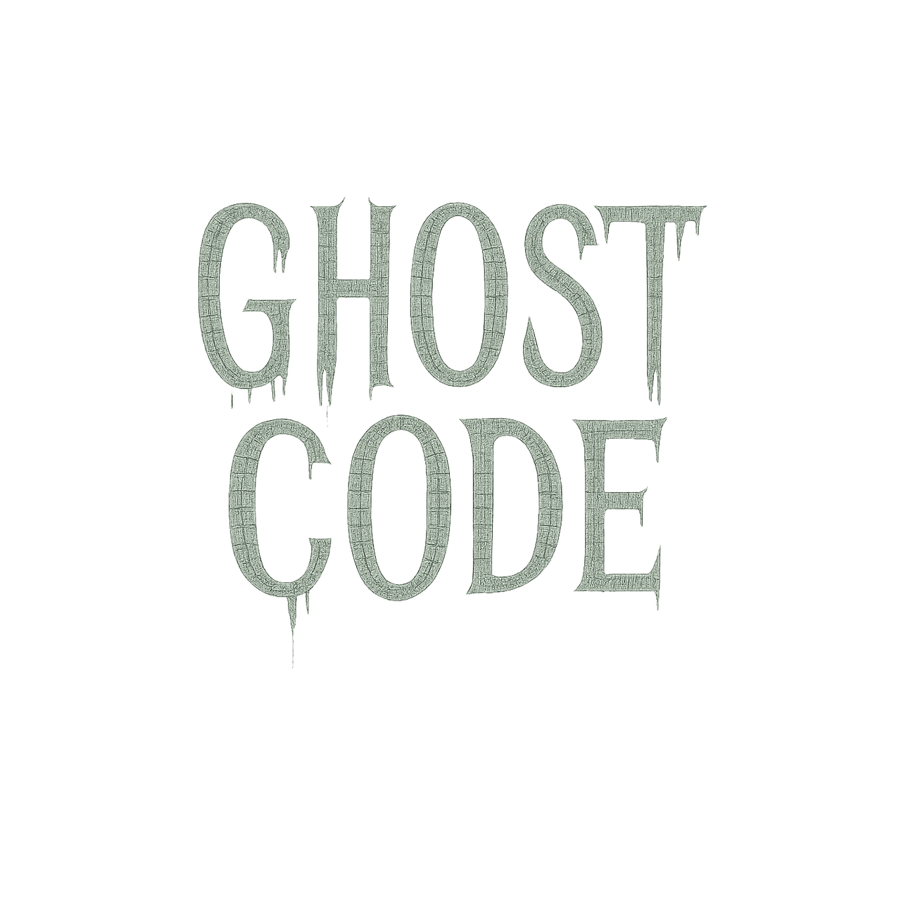

<p align="center">
  
</p>

<h1 align="center">Ghostcode</h1>

<p align="center">
  <a href="https://www.npmjs.com/package/@fa33az/ghostcode"></a>
  <a href="https://www.npmjs.com/package/@fa33az/ghostcode"></a>
  <a href="LICENSE"></a>
  <a href="https://nodejs.org"></a>
  <a href="https://www.typescriptlang.org/"></a>
  <a href="https://ts-morph.com/"></a>
  <a href="https://github.com/tj/commander.js"></a>
</p>

<p align="center">
  Deep structural and behavioral static analysis CLI tool to detect <b>Ghost Code</b> in TypeScript repositories.
</p>

---

## Table of Contents

- [Overview](#overview)
- [Key Features](#key-features)
- [Architecture](#architecture)
- [Installation](#installation)
- [CLI Usage & Options](#cli-usage--options)
- [Automated Fix & Prune Modes](#automated-fix--prune-modes)
- [LCOV Coverage & Orphan Author Analysis](#lcov-coverage--orphan-author-analysis)
- [Configuration File](#configuration-file)
- [GitHub Action Integration](#github-action-integration)
- [Ghost Score Calculation Engine](#ghost-score-calculation-engine)
- [Author](#author)
- [License](#license)

---

## Overview

**Ghost Code** refers to code that is syntactically valid and non-throwing, yet structurally isolated, rarely modified, untested, and virtually unreferenced within a codebase.

Unlike superficial unused import linters, **Ghostcode** combines AST static analysis, Git revision metrics, LCOV test execution coverage, and author ownership tracking to evaluate code viability through a multi-factor behavioral scoring engine.

---

## Key Features

- **Deep AST Reference Analysis**: Uses `ts-morph` to traverse inter-file import graphs, exported function references, and internal call sites.
- **Git History & Author Metrics**: Analyzes commit frequency, modification age, and flags **Orphan Code** written by contributors who left or haven't committed in > 365 days.
- **LCOV Test Coverage Integration**: Cross-references AST symbols with `lcov.info` execution coverage data.
- **Automated Fix & Prune Engine**: `--fix` appends `@deprecated` JSDoc tags to ghost functions; `--prune` safely strips unreferenced internal ghost code.
- **Custom Config Support**: Load custom scoring weights and glob ignores via `.ghostcoderc` or `ghostcode.config.json`.
- **GitHub Action Workflow**: Ready-to-use CI/CD workflow (`.github/workflows/ghostcode.yml`).

---

## Architecture

```
ghostcode/
├── .github/workflows/
│   └── ghostcode.yml     # Automated GitHub Action workflow
├── src/
│   ├── index.ts          # CLI entry point powered by Commander
│   ├── scanner.ts        # Core scan pipeline orchestrator
│   ├── gitAnalyzer.ts    # Git history, revision timestamp & author orphan parser
│   ├── astAnalyzer.ts    # Static AST dependency & test analyzer (ts-morph)
│   ├── ghostScorer.ts    # Dynamic 6-factor Ghost Score calculation engine
│   ├── configLoader.ts   # Configuration file loader (.ghostcoderc)
│   ├── coverageAnalyzer.ts # LCOV test execution coverage parser
│   ├── fixer.ts          # Automated AST fixer (@deprecated tagging & function pruning)
│   ├── reporter.ts       # Chalk terminal and JSON reporting module
│   └── types.ts          # Domain models and interface definitions
├── assets/
│   └── logo.png          # Project logo
├── dist/                 # Compiled ESM production output
├── package.json
└── tsconfig.json
```

---

## Installation

### Global Installation

```bash
npm install -g @fa33az/ghostcode
```

### Local Repository Installation

```bash
git clone https://github.com/fa33az/ghostcode.git
cd ghostcode
npm install
npm run build
npm link
```

---

## CLI Usage & Options

```bash
ghostcode [options]
```

### Options Reference

| Flag | Type | Default | Description |
| :--- | :--- | :--- | :--- |
| `-p, --path <dir>` | `string` | `.` | Target project directory to analyze |
| `-t, --threshold <number>` | `number` | `70` | Minimum Ghost Score threshold (0–100) for candidate flagging |
| `-c, --config <file>` | `string` | - | Path to custom ghostcode config file |
| `--coverage <file>` | `string` | - | Path to LCOV coverage file (e.g. `coverage/lcov.info`) |
| `--orphans` | `boolean` | `false` | Analyze Git author history for orphan contributors (> 365 days inactive) |
| `--fix` | `boolean` | `false` | Automatically append `@deprecated` JSDoc tags to ghost functions |
| `--prune` | `boolean` | `false` | Safely remove unreferenced internal ghost functions |
| `--json` | `boolean` | `false` | Output results in raw JSON format |
| `--debug` | `boolean` | `false` | Enable verbose log output |
| `-v, --version` | `boolean` | - | Display version information |
| `-h, --help` | `boolean` | - | Display help documentation |

---

## Automated Fix & Prune Modes

- **Tagging Deprecated Ghost Code**:
  ```bash
  ghostcode --fix --threshold 70
  ```
  Appends `@deprecated Ghost code detected by ghostcode analysis.` JSDoc tags to identified ghost functions using `ts-morph`.

- **Safe Pruning Internal Ghost Code**:
  ```bash
  ghostcode --prune --threshold 80
  ```
  Safely removes internal, unexported, unreferenced ghost functions directly from source files.

---

## LCOV Coverage & Orphan Author Analysis

- **Include Test Execution Coverage**:
  ```bash
  ghostcode --coverage ./coverage/lcov.info
  ```

- **Detect Orphan Code**:
  ```bash
  ghostcode --orphans
  ```
  Flags code whose primary author has not committed anywhere in the repository for over 365 days.

---

## Configuration File

Create a `.ghostcoderc` or `ghostcode.config.json` in your project root:

```json
{
  "threshold": 70,
  "weights": {
    "ageWeight": 0.25,
    "referenceWeight": 0.25,
    "testWeight": 0.2,
    "commitWeight": 0.15,
    "coverageWeight": 0.15,
    "orphanWeight": 0.1
  },
  "ignore": [
    "**/vendor/**",
    "**/legacy/**"
  ]
}
```

---

## GitHub Action Integration

Create `.github/workflows/ghostcode.yml`:

```yaml
name: Ghost Code Analysis

on:
  push:
    branches: [ main, master ]
  pull_request:
    branches: [ main, master ]

jobs:
  ghostcode:
    runs-on: ubuntu-latest
    steps:
      - uses: actions/checkout@v4
      - uses: actions/setup-node@v4
        with:
          node-version: '20'
      - run: npm ci
      - run: npm run build
      - run: npx ghostcode --threshold 70 --orphans
```

---

## Ghost Score Calculation Engine

The **Ghost Score** ranges from **0 (Active Code)** to **100 (Likely Dead Code)**.

### Formula

```
Ghost Score = (Age * W_age) + (Ref * W_ref) + (Test * W_test) + (Commit * W_commit) + (Coverage * W_cov) + (Orphan * W_orph)
```

### Risk Classifications

- **HIGH RISK (Score >= 70)**: High probability of obsolete or dead code.
- **MEDIUM RISK (Score 40–69)**: Low reference density or outdated code requiring inspection.
- **LOW RISK (Score < 40)**: Actively maintained or well-referenced code.

---

## Author

**Fawwaz Fadhil Rasyad**
- GitHub: [@fa33az](https://github.com/fa33az)

---

## License

This project is licensed under the **MIT License** - see the [LICENSE](LICENSE) file for details.
